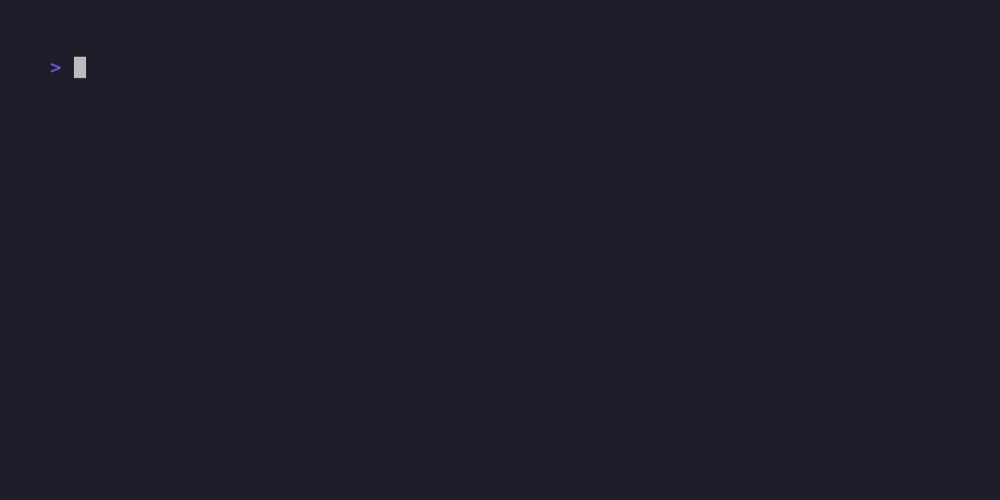

# Polars Prompt

[](https://github.com/esadek/polars-prompt/actions/workflows/ci.yml)

[](LICENSE)

Command line interface for the Polars Python API



## Features

- Syntax highlighting while typing
- Multi-line input editing
- Mouse support for cursor positioning and scrolling
- Input history

## Usage

```bash
polars-prompt
```
